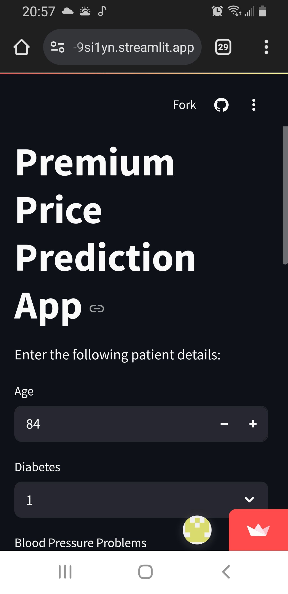

# 🏥 Premium Price Prediction App

This is a machine learning web app built with **Streamlit** that predicts medical insurance **Premium Prices** based on patient details. The model was trained using a **Random Forest Regressor** on a healthcare dataset.

---

## 🚀 Demo

---

## 📌 Features

- Predicts premium price based on user inputs like:
  - Age
  - Diabetes
  - Blood Pressure Problems
  - Any Transplants
  - Chronic Diseases
- Interactive UI using Streamlit
- Deployed locally or easily on Streamlit Cloud

---

## 🧠 Machine Learning

- **Model Used**: Random Forest Regressor
- **Target Variable**: `PremiumPrice`
- **Libraries**: `pandas`, `scikit-learn`, `xgboost`, `streamlit`, `pickle`

---

## 📂 Project Structure
📁 Premium-Price-Prediction-App/
- ├── app.py # Streamlit app
- ├── model.pkl # Trained Random Forest model
- ├── requirements.txt # Python dependencies
- └── README.md # Project documentation

----
📈 Model Evaluation
- RMSE: 2305.81
- R² Score: 0.88
----
📜 License
- This project is licensed under the MIT License.
